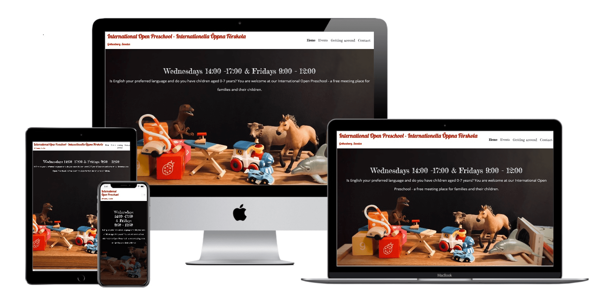

# International Open Preschool - International Öppna Förskola

In Sweden, there is a state funded institution called "öppna förskola" which is provided for parents on parental leave as an indoor space to go 
and spend time with their small children. There are few educators but they don´t take any responsibility for the children, it is always their parents duty.
This place could be also called a "playgroup" or "indoor playground". 

Unfortunately despite the amout of expats and foreigners living in Gothenburg, Sweden, there is no such place that would be dedicated to English speaking parents, 
although there is a high demand for such place and many small playgroups are organized by individual parents through social media.
Therefore I created this fictional project called "International Open Preschool". 
The main goal is to present a nice indoor playground for English speaking parents where they can meet other parents and socialize while their children can play around.

This website and place are fictional although I personally believe that if it would existed, there would be a high demand for its services in Gothenburg.
 
## UX
### User stories:
  - Expected goals of first time page visitors:
    1. English speaking parents who just recently moved to Gothenburg and are trying to get to know some people-other parents.
    2. English speaking parents who are looking for a place where they can speak English with other parents and/or provide a place for their kids to find other English speaking children.
    2. Parents who are looking for a convenient place where to go with their kids, mostly during winter time.
    3. Parents who want to find out more information about what to do in Gothenburg with children, they are interested mainly in Events page.
    4. Parents who are looking for some specific help and want to reach out to us, e.g. need a specific help with finding a preschool, don´t know where and who to ask.
    5. Other children professionals who work with parents, therefore they visit the web as a part of their research for giving advice.

  - Expected goals of second (and more) time page visitors:
    1. Trying to find the address
    2. Going to check the Event page and/or book their attendance at an event
    3. Need to verify information such where is a meeting, what are the facilities, what are the links to other place to visit around town
    4. Going to send in a query

### Design of the website:
#### Typography
- The page uses three fonts from [Google Fonts](https://fonts.google.com/ "Google Fonts"):
  - 'Lobster' - for main title International Open Preschool, there is no other place where it is repeated therefore it serves as a logo
  - 'Fredericka the Great' - most headings
  - 'Open Sans' - all other text. To improve visibility I mainly use font in bold.

#### Colors
- Color theme is based on the background image where there is orange, blue, grey and violet color. 
  - the orange color was not that well visible so I used either a darked version of orange or replaced it by red.
  - For the main title-logo I used rgb(185, 27, 6). It is rather red color but is well visible and is on purpose different to the other colors although still in balance.
  - Orange colors are variants of: rgb(212, 52, 7).
  - Blue colors are variants of: rgb(31, 70, 96).
  - Red color are variants of: rgba(220, 53, 69) and Bootstrap "danger" theme.
  - Grey color is Bootstrap "light" theme.

#### Imagery
- The main background image is setting the overall look for the whole website and creates a visual connection.
- The large hero background image has been chosen to bring warm, welcoming athmosphere where there is a place for fun and games for different ages of children.
- Two pictures instead of profile are meant to point out a bit of humor and "light" athmosphere the Open Preschool has meanwhile they are meant to provide a bit of characteristics (teddy bear with coffee, a robot)

#### Wireframes
- [Home Page 1](wireframes-mockups/home1-wireframe-min.png)
- [Home Page 2](wireframes-mockups/home2-wireframe-min.png)
- [Events](wireframes-mockups/events-wireframe-min.png)
- [Getting around]wireframes-mockups/getting-around-wireframe-min.png)
- [Contact](wireframes-mockups/contact-wireframe-min.png)

#### Mockups
- [Home](wireframes-mockups/IOF-home-page-mockup-min.png)
- [Events](wireframes-mockups/IOF-events-mockup-min.png)
- [Getting around](wireframes-mockups/IOF-getting-around-mockup-min.png)
- [Contact](wireframes-mockups/IOF-contact-mockup-min.png)

## Features

### Existing Features
- All buttons and links were styled using Bootstrap button/links classes
- **Navigation** 
    - Each page starts with the logo of International Open Preschool that serves also as a "go to home page" link. The navigation was implemented by Bootstrap navbar classes with included toggler that is visible on small device screens. The navigation menu has already implemented hover functions and "active" functions from Bootstrap.
- **Footer** 
    - Each page ends with footer where there are implemented links to social media website of Internation Open Forskola.
    - Copyright information and link to Goteborg Stad - Gothenburg municipality who is the organizor of all öppna forskolas in town.
- **Home** 
    - Hero image that is meant to create warm, fun and welcoming athmosphere, bellow are circles with headings and main description - the idea is to provide children related but yet a bit smooth design that is targeted at parents-readers
    - Each topic of "circles" section allows the viewer to provide more information if required by clicking on a *button* - to Events, to Getting around and to Contact. Each circles leads to one page in the provided order.
- **Events**
    - Two sections (regular and irregular events) are devided by colors and space in order to provide clear orientation which events repeat, which are only once.
    - Some events require to book a place, therefore a submit button from Bootstrap is added that links to Contact page
- **Getting around** 
    - A simple page intentionally doesn´t bring too much of design surprise, so that viewer can easily click on information they are looking for and find information under the relevant link. Icons support the content.
    - Provides simple links to other places to visit in town. 
- **Contact** 
    - Address as the first accessible information as people would be in need to find that quickly. Form below to provide a communication tool. Red lines are cut intentionally to make it look "unusual". Cards with direct contacts and profile "nickname" images of toys instead of people in order to protect identity and also to trigger some fun experience for viewer.
    - Provides a form for conversation purposes. Viewer adds their contact information (see below) and submits, a modal popup has been implemented to inform viewer the data were obtained.

### Features Left to Implement
- Getting around - could be connected to Google Calendar
- Contact page - the validation could be more playfull such as "Looks good" / "Please provide a valid email"
- Contact page - viewer would see the whole screen when opening page, failed to put pictures to the left side of the text
- In general more moving features could be implemented to bring more playful feeling

## Technologies Used
(adapted accordingly by: https://github.com/Code-Institute-Solutions/SampleREADME)
- **Bootstrap v5.0** - Bootstrap was used to assist with the responsiveness and styling of the website.
- **Google Fonts** - Google fonts were used to import all fonts into the style.css file which is used on all pages throughout the project.
- **Font Awesome** - Font Awesome was used on all pages throughout the website to add icons for aesthetic and UX purposes.
- **jQuery** - came with Bootstrap to make the navbar responsive and also to help modal popup to work.
- **Git** - used for version control by utilizing the Gitpod terminal to commit to Git and Push to GitHub.
- **GitHub** - used to store the projects code after being pushed from Git.
- **Painting** - was used to crop images
- **MS Office Power Point** - used for creating wireframes

## Testing
#### Website has been tested and corrected by: 
- https://www.freeformatter.com/html-formatter.html
- https://validator.w3.org/#validate_by_input
    - Problem found:
        - Events - section class="events-intro" lacks heading - this is on purpose
        - Getting around - section class="getting-around-intro" lacks heading - this is on purpose
                         - section class="geting-around" lacks heading - this is on purpose

- https://jigsaw.w3.org/css-validator/validator
    - problems shown in the Circles area - shape-margin and shape-outside does not exist. This part of code has been copied (see link below) therefore I will keep it as it is.
- http://techsini.com/multi-mockup/index.php used for creating and checking mockups

#### Testing of features:
The website was opened in Chrome, Mozzilla Firefox, Safari and Microsoft Edge to test all features and their functions. 
Also cache was cleared every time before I loaded the page.
All links leading to different website open in new windows.

- **Navigation** - needs to link viewer across the website. Clicked repeatedly to links in menu to find out whether it leads properly to the pages and then the other way back as well.
- **Circles and button links** - each circle on Home page contains text with link to other page in order to provide more information t the viewer. Links in each circle-area were clicked to check their functionality in all browsers.
- **Footer** - all icons and link to Goeborg Stad were clicked and checked for their functionality. 
- **Events** - three regular events and one irregular event contain links/ buttons to Contact page. All for buttons were checked and clicked repeatedly.
- **Getting around** - each list item contains link to a tip for place where to go. Links were checked if they lead where they are supposed to.
- **Contact** - Form was checked, all input items were filled in, after clicking on submit button a modal popup appears. Despite there was added validation-required, unfortunately at the current level of skills I cannot implement more tools for validation. Left for future development.

#### Testing User Stories from User Experience (UX) Section
##### First Time Visitor Goals
- Most common path starts at Home page and from there goes to other pages upon personal interest.
- The purpose of the page is clear from the Logo and Hero image - both the text and background picture. More information is provided when scrolling down the page in order to provide most basic information about International Open Preschool.
- The visitor can easily navigate the site through clicking on buttons either in Circles section on Home page or through Navigation bar.

##### Second Time Visitor Goals
- The viewer opens Home page as default but as he/she is looking for specific information there is a clear path how to get there: either he/she scrolls down the Home page or through Navigation bar gets to part which he/she is looking for.
- All main information that are expected to be seeeked for frequently are placed to top of pages: main iformation about days in week and times of opening as the first information (after logo and navigation) on Home page. Address is also places as the first information on Contact page. 

### Problems during testing and development
**1. Main problem was footer**
      - extremely time consuming was footer which from an unknown reason doesn´t appear on bottom at certain device screen sizes IF the page does not have a vertical scroll down (Getting around and for xxl screens Contact). Mentor and many tutors were asked for help but not a perfect solution was find. I was told to change height, min-height on different elements, I was playing with position:absolute and relative, with bottom, margins and padding but nothing was fully successfull. 
      Therefore as a final decision I implemented media queries for different screen sizes. Unfortunately not even this is fully working on every device as it was tested by family and friends but as the problem with "floating" footer is considering mainly only one page (Contact) AND only resolution for iPad or very large screens, I decided to leave it as it is.

**2. Circle Premises** - circle Premises is not showing the text only in Mozzilla Firefox. Other circles work fine in all browsers.

**3. Hero image doesn´t show in Safari**

**4. Circles were not showing well on small screens** - the problem was fixed with a help of tutor with removing fixed height. 

**5. Targeting Bootstrap classes** - through the entire project I was having problems rewriting classes from Bootstrap. Where I found a solution the class was overwritten, on some parts I simply went with Bootstrap default in order to save time. That is for example the case of color of buttons, color of modal popup (and its aligning, I was unable to align text to center).

**6. Scroll to left** - I had a lot of problems getting rid of the horizontal scroll space. With a help of third tutor I was able to fix it.

## Deployment
The website was develope on hosting page GitHub with a help of GitPod. Therefore the deployed page is hosted on Github Pages.
Now the website is published on: https://kamilahase.github.io/MS1---International-Open-Preschool/

### GitHub Pages
(credit: https://github.com/Code-Institute-Solutions/SampleREADME)
The project was deployed to GitHub Pages using the following steps:
1. Log in to GitHub and locate the GitHub Repository
2. At the top of the Repository (not top of page), locate the "Settings" Button on the menu.
3. Alternatively Click Here for a GIF demonstrating the process starting from Step 2.
4. Scroll down the Settings page until you locate the "GitHub Pages" Section.
5. Under "Source", click the dropdown called "None" and select "Master Branch".
6. The page will automatically refresh.
7. Scroll back down through the page to locate the now published site link in the "GitHub Pages" section.

### Forking the GitHub Repository
1. By forking the GitHub Repository we make a copy of the original repository on our GitHub account to view and/or make changes without affecting the original repository by using the following steps...
2. Log in to GitHub and locate the GitHub Repository
3. At the top of the Repository (not top of page) just above the "Settings" Button on the menu, locate the "Fork" Button.
4. You should now have a copy of the original repository in your GitHub account.

### Making a Local Clone
1. Log in to GitHub and locate the GitHub Repository
2. Under the repository name, click "Clone or download".
3. To clone the repository using HTTPS, under "Clone with HTTPS", copy the link.
4. Open Git Bash
5. Change the current working directory to the location where you want the cloned directory to be made.
6. Type git clone, and then paste the URL you copied in Step 3.
7. $ git clone https://github.com/YOUR-USERNAME/YOUR-REPOSITORY
8. Press Enter. Your local clone will be created.

## Credits
The actual **content** was inspired by existing öppna forskolas in Gothenburg, mainly 
[Öppna Förskolan Draken](https://goteborg.se/wps/portal/enhetssida/familjecentralen-glasmastaregatan-draken/oppna-forskolan/!ut/p/z1/04_Sj9CPykssy0xPLMnMz0vMAfIjo8ziTYzcDQy9TAy9_S0szA0czS18DEx8DA2BbP1wsIIAQxdHQxOgAgMPQzcDx0BXM_8gVxMDAx9T_Shi9BugAEcDpyAjJ2MDA3d_I3L0I5tEnH48CqLwG1-QGwoEjooAKEDC7w!!/dz/d5/L2dBISEvZ0FBIS9nQSEh/)
and
[Leksaksbiblioteket](https://www.leksaksbiblioteket.se/).

The **design of content** was taking inspiration from: 
 - https://auxfuse.github.io/Milestone1/
 - https://damianism.github.io/custom_pc/index.html
 - The Whiskey Project, Love Running and Resume by Code Institute

The **code** was inspired by: 
- https://css-tricks.com/using-css-to-set-text-inside-a-circle/ - the circle sections adapted according to this copies code.
- [Bootstrap v5.0](https://getbootstrap.com/)

### Acknowledgements
Many thanks to my mentor who provided me with insprational feedback.
Many thanks to tutors of Code Institue who´s help was highly appreciated and saved my nerves.

### Media
- **Hero Image** - my own photography
- **Background picture** - https://pixabay.com/images/id-1637197/
- **Teddy bear with coffee** - https://wallpaper.mob.org/image/igrushki-medvedi-obekty-28514.html
- **Robot** - by Phillip Glickman, https://unsplash.com/photos/2umO15jsZKM

## Full content

**HOME    EVENTS 	    GOTHENBURG WITH KIDS	    CONTACT**

### INTERNATIONAL OPEN PRESCHOOL - INTERNATIONAL ÖPPNA FÖRSKOLA 
#### Gothenburg, Sweden

Wednesdays 14:00 -17:00 & Fridays 9:00 - 12:00
Is English your preferred language and do you have children aged 0-7 years? You are welcome at our International open preschool - a free meeting place for families and their children.
 
**HOME**

##### Öppna Förskolan in Sweden
You may have heard of the öppna förskolan institutions in Sweden - an equivalent to a preschool where children are accompanied by their parents (and no responsibility is taken from the staff) but they can fully enjoy the large premises full of toys.
As a parent you get the opportunity to make new, mainly international contacts, receive information about life in Gothenburg, Sweden or get support in the parental role in a new country.
It is free to visit our International Open Preschool and you do not need to register in advance.

##### A place to play and talk 
Everyone who can speak English is welcome to the international open preschool. We are mainly focused on creating a space for international residents living in Gothenburg and providing support in living abroad as a parent. Although if you are a Swede who wants to get to know other English speaking parents, you may join our playgroups as well!
Here you can play together with your children, do crafts, enjoy your coffee and participate in group activities such as singing, occasional theater performances, outdoor walks or meetings with specialists.
The regular meetings are free of costs and you do not have to register yourself or your child in advance. There is only a small fee for our coffee and snacks of 20SEK. Other events may be payed depending on the type of activity.

##### Premises
We share our premises with a communal öpnna förskolan at DIAMANTGATAN 24 - OPALTORGET. Thanks to their generosity, we are able to provide a fully equipped 3 rooms full of toys, tables for arts&crafts, a dining room with kitchen and a microwave, as well as a quiet zone for breastfeeding. Our restrooms provide changing tables and potties for toddlers. You can park your stroller in our hallway where it is safe to leave your child nap as well.

**EVENTS**

A group of activities are organized on a regular basis, others can be spontaneous and they are mostly organized by parents themselves.
Please do not hesitate to reach to us in case you would like to come up with an event idea!
Follow us on social media to get the most up to date information.

#### Regular activities: 
- **Reading book in your language**
A native speaker comes to read in one of these languages: Arabic, German, French, Polish and Spanish. Every week is one language only, therefore the same language repeats every five weeks.
In case you would be interested in another language, please let us know!
Next language: German
EVERY WEDNESDAY, 16:30 - 17:00

- **Meeting with a child care professional** 
We arrange a diverse range of meetings with professionals in health, education, after class hobbies and many other areas.
Next topic: "Children health check-ups in Sweden and private care." / Dr. Joanna Bell
EVERY FIRST SATURDAY IN A MONTH, 16:30 - 17:00

- **Svenska med barn** 
Learn Swedish together with your child. Parents focus on learning with a teacher while their kids can run around and play with our educators.
We also offer Swedish classes for children up to 15 years upon request, a fee might be charged.
EVERY FIRST SATURDAY IN A MONTH, 13:00 - 14:30

#### Irregular activities: 
- **Child Clothing&toys Marketplace**
Collection of clothes and toys will be the whole month prior the marketplace´s date.
    09. 04. 2022, 16:00 - 18:00
- **Regional pop-up meeting: Brazil**
Plikta, Slottskogen, meeting point is the toy train.
Find us by the common language!
    04. 05. 2022, 10:00 - 12:00
- **Regional pop-up meeting: Australia**
Plikta, Slottskogen, meeting point is the toy train.
Find us by the common language!
    22. 05. 2022, 10:00 - 12:00
- **Three Little Piggies**
International Berlin Theatre for children is coming to our place!!
BOOKING NEEDED.
Ideally for children aged 2-5 years old but older and younger kids are also welcome.
    12. 06. 2022, 15:00 - 16:00

**GOTHENBURG WITH KIDS**	

Are you looking for tips what to do and where to go in Gothenburg? Here we gathered a few links of places that we hope might help you to get to know the city better. For more information please visit the home pages of each institution.

Öppen Förskola in Gothenburg - list of regular open preschools

- **Världskulturmuseet** - Museum of World culture, 2nd floor dedicated to children, free entrance https://www.varldskulturmuseet.se/
- **Universeum** - a science centre and museum dedicated to children https://www.universeum.se/
- **Liseberg** - amusement park https://www.liseberg.se/
- **Göteborgs stadsmuseum** - Gothenburg City Museum, 3rd floor dedicated to children https://www.goteborgsstadsmuseum.se
- **Göteborgs Naturhistoriska Museum** - Gothenburg Museum of Natural History, free entrance https://www.gnm.se
- **Leo's Lekland** - fun park, trampolines, slides etc., two premises in Gothenburg: Mölndal and Partille https://www.leoslekland.se
- **Outdoor playgrounds** - list of most playgrounds around town https://goteborg.se/wps/portal/start/kultur-och-fritid/fritid-och-natur/parker-lekplatser/lekplatser/hitta-lekplatser?uri=gbglnk%3Agbg.page.e9777318-dc81-4755-9d60-628f8f146ffba&servicetype=Lekplatser

**CONTACT**

Diamantgatan 24, Göteborg, 451 23.

Please don't hesitate to contact us!
Fill in the form in case you want to tell us anything or attend one of our events that need subscription. In case you prefer a direct contact, use email or phone of one of our educators.

Enter your full name
Enter Your Email
Area of your query
What is on your mind?
Submit - Thank you! We will get back to you as soon as possible. 

Anna Smith
anna.smith@intoppnaforskola.se
+46 792 54 87 22

Nina Eriksson
nina.eriksson@intoppnaforskola.se
+46 797 55 61 24

**FOOTER**

Facebook, LinkedIn, Pinterest
Copyright 2021: Göteborg Stad

